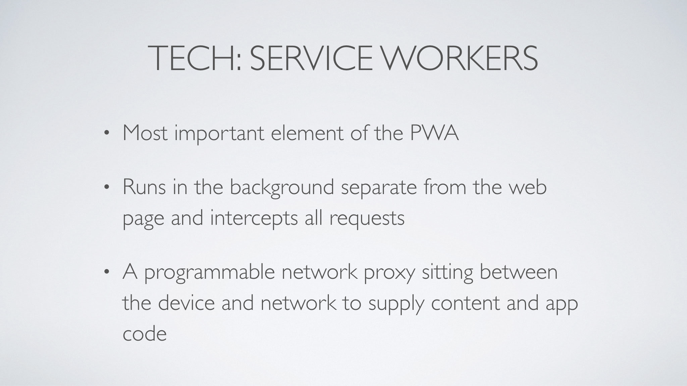

# Unspoilt By Progress
## _An introduction to Progressive Web Apps_

There are a few different definitions of a PWA but I prefer this one...

PWAs came out of projects a Google and there are their headline features:

* **Reliable**: Load instantly and never unavailable, even with slow or NO network
* **Fast**: Respond quickly to user interaction. No 'janky' scrolling.
* **Engaging**: Feel like a natural (sic) app with immersive user experience.

* **Responsive**: In terms of fitting multiple device sizes. No brainer.

* **Network resilient**: Loads without requiring a network connection and offers some interactivity even when offline.

* **Fast**: Repond immediately to user interaction. Smooth scrolling seems to be an obsession.

* **App-like**: In terms of style of interaction and navigation.

* **Installable**: Should be able to be installed on the user's "home" screen to be opened again quickly

* **Discoverable**: Identified as applications by search engines.

* **Linkable**: Easily shared and installed.

* **Engaging**: Offering features like push notifications, fullscreen.

* **Splash screen**: Display a splash screen when opened to ~~show that~~ make it look like something is happening.

Or "App Shell Architecture".

Service workers should efficiently manage the application's code and data caching to allow it to work error-free in offline mode.

Requires browser support - available in major browsers except IE (though it is in Edge).

Can be killed and re-started if necessary so any state must be saved into browser storage.

One of the first jobs of a service worker is to cache the app shell on installation. It will then terminate and be re-activated to process network (fetch) requests or messages from pages under its scope. Scope will be the directory holding the service worker JS file and any sub-folders.

Will serve the assets from the cache if the exist or get them from the network. Data may be handled differently.

Should handle push notifications.

By definition PWAs are progressive enhancement the app should operate reasonably well without the service worker.

_Image from Google Developers._

The service worker lifecycle. Triggered and kept alive by events.

Includes elements such as:

* Application name
* Links to assets such as icons or other images
* Launch URL
* Display mode (e.g. fullscreen)

The manifest is crucial for installation alongside other app icons and discoverability.

If the manifest is linked from the current page (and best practice is to add it to all pages) and a service worker is register then the Add to Home Screen dialogue should be available.

Guidelines say the icon should be at least 144×144 large in PNG format.

You _could_ use `localStorage` but it isn't recommended.

Web assembly allows some portions of application code to be written in languages other than JS.

Web workers closely related to service workers - move some of the processing off the UI thread to make the interface more responsive.

In an effort to squeeze some ruby into the talk…

To get basic functionality shouldn’t need to re-architect much.

Cache versioning can help to alleviate any pain from updating the service workers - existing users will still get the old version of the app and data.

